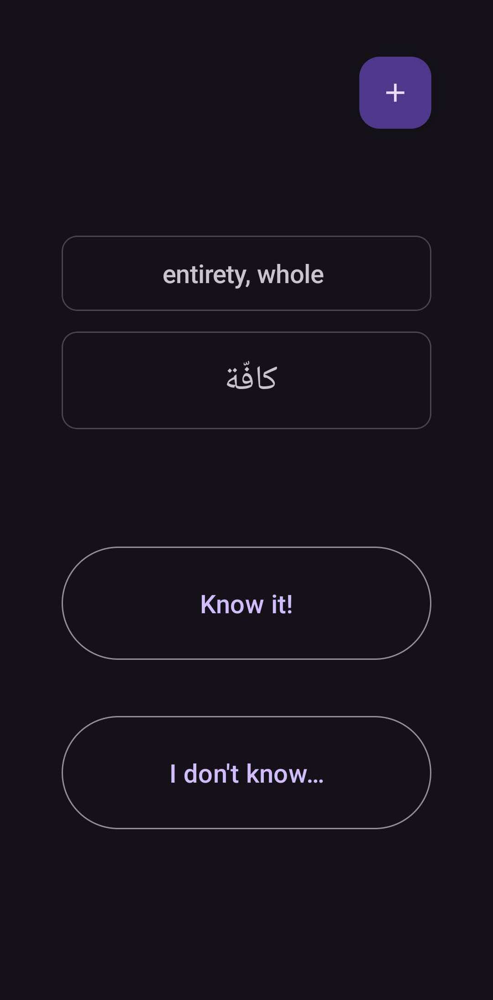
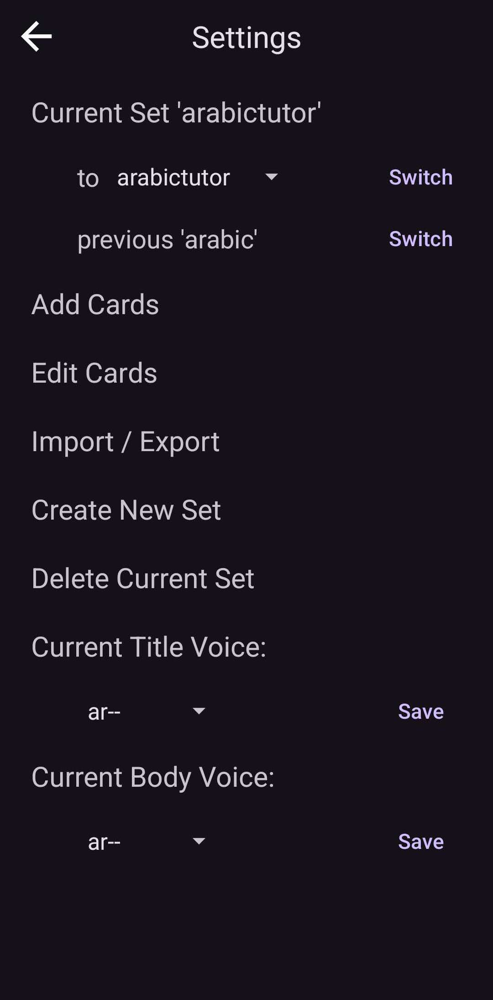

# Flash Card App

  

This is an Android Flashcard App ideal for personal learning and memorization purpose, with built-in algorithm to help you create and memorize your own flashcards efficiently.

The project explores practical aspects of vocabulary management and lightweight data modeling, with an emphasis on clarity and maintainability rather than feature completeness.

*This project is separate from my quantitative finance work and represents a continuously evolving hobby project driven by personal use cases.*

### Demo Screenshots

  
  

---

## Project Status

The application is under active development.

Features are implemented incrementally as they become relevant to personal workflows.

---

## Development Todos

### Short-Term
- Ensure correctness and robustness of the Python-based vocabulary list generator
  - Move list metadata into the zero-card representation
- Rework import/export functionality using the Android Storage Access Framework (SAF)
- Verify card insertion and processing behavior for large decks
- Introduce support for:
  - bijective (two-way) card sets
  - one-way card sets
  with configuration stored in the zero-card metadata

---

### Planned Improvements
- Add save-and-exit behavior for edit activities with user feedback
- Reorganize settings into dedicated activities:
  - Edit collection activity
  - Edit text-to-speech (TTS) activity
- Provide a Python utility to reset or regenerate card sets

---

### Non-Essential / Exploratory
- Theme support
- Bookmark editing behavior
- Database behavior cleanup
- Settings documentation page describing app behavior
- Optional TTS playback on card tap
- Further documentation improvements

---

## Creating Vocabulary Lists

In addition to creating vocabulary lists directly within the app, lists can be generated from raw vocabulary–definition pairs using a small companion Python script [using a small companion Python script here](raw-vocab-to-meta-tool.py).
